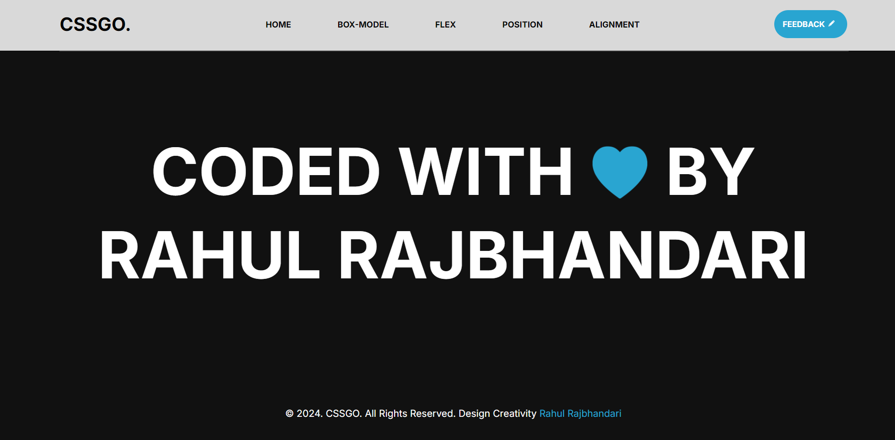
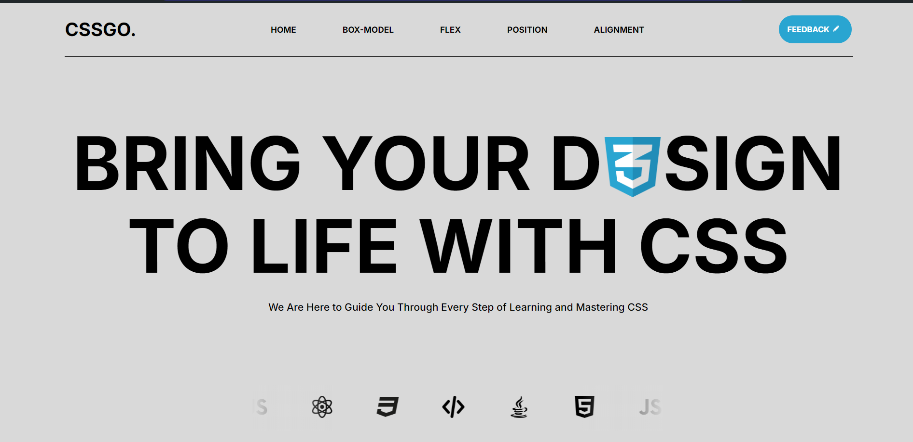
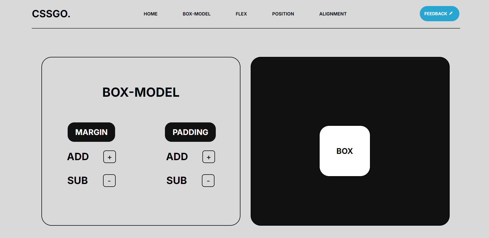
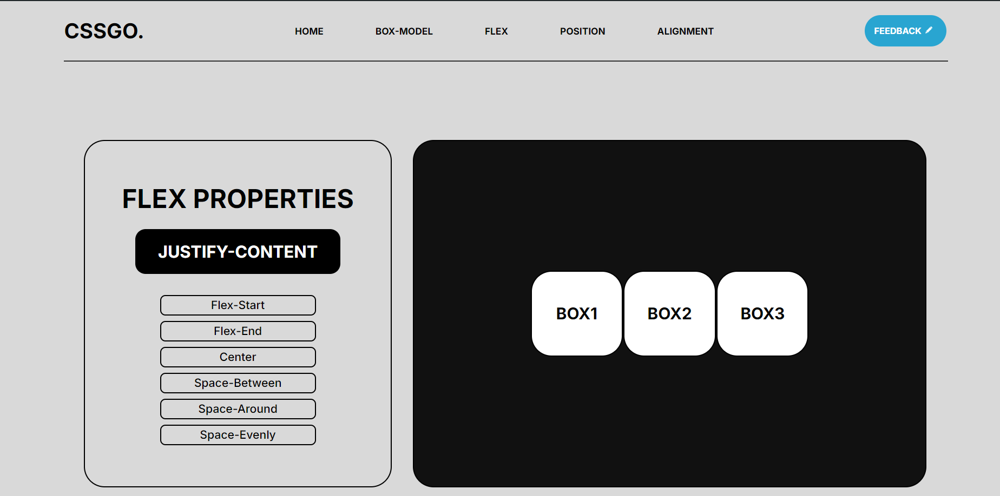

#CSSGO.

<h2 align="center">Hi 👋, I'm Rahul Rajbhandari</h2>

We Are Here to Guide You Through Every Step of Learning and Mastering CSS

## Screenshots

## Visit the website :
[@cssgo.](https://cssgo.netlify.app)

## Languages Used:

